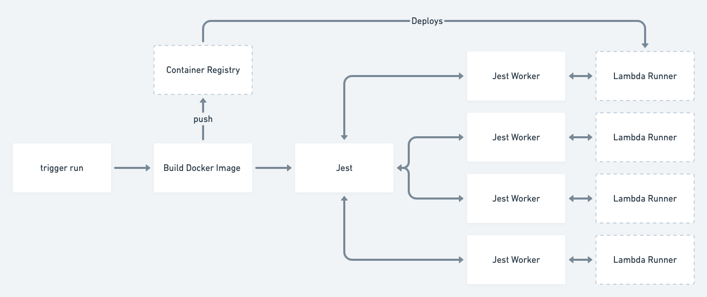

# Wormhole CI

Stop worrying about manually crafting a parallel CI pipeline and start folding execution time by forming wormholes in your CI workflows 🚀


## Components

- [Terraform CDK](https://cdk.tf)
- [AWS Lambda Docker Runtime](https://docs.aws.amazon.com/lambda/latest/dg/lambda-images.html)
- [Jest as a Platform](https://www.youtube.com/watch?v=NtjyeojAOBs&ab_channel=ReactiveConf)

## How does it work

Jest uses [workers](https://github.com/facebook/jest/tree/master/packages/jest-worker) to run parallel tests. It's essentially possible to run each test file on its own worker. That's exactly what we're doing here. However, rather than running the test locally, the worker calls out to Lambda function and reports the result back to the Jest process.


## Status

This is a proof of concept at this point. The goal is to drastically reduce the run time of integration test pipelines without sacrificing developer experience.

### Things to figure out

- Reduce deployment time (biggest gain is likely correlated with smaller Docker images)
- Local EFS mount, rather than code deployments for local testing (needs VPN or a proxy)
- Alternatively, use a remote container for VS code which could easily mount EFS
- Handle test specific settings / runners (e.g. a specific Docker image for a test / test group)
- Is there another way of splitting tests than files? (patterns maybe)
### Alternative runners

It would be great to support more runner types. This would likely enable Windows and Mac builds as well.

- Use Fargate as runner
- Use Google Cloud run as runner
- Use Azure Functions as runner
- Use Azure App Service as runner
## Usage

Make sure to have valid AWS credentials in your env.

```
yarn install
yarn build
cd packages/lambda
cdktf deploy --auto-approve
cd ../../examples/terraform
yarn test
```